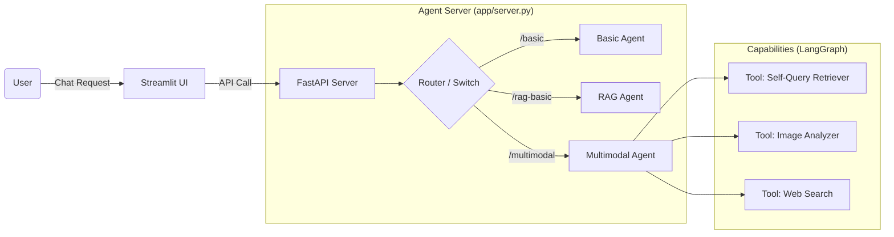

# LLMOps Hands-on: Building Advanced RAG Agents

이 프로젝트는 LLMOps 과정의 일환으로, 기본 RAG부터 멀티모달 에이전트까지 단계별로 구축해보는 실습용 저장소입니다.  
FastAPI로 백엔드 서버를 구축하고, LangGraph를 이용해 에이전트를 설계하며, Streamlit으로 사용자 인터페이스를 연결하는 전체 파이프라인을 경험할 수 있습니다.

---

## 📂 Project Structure

이 프로젝트는 크게 **앱(Back-end/Front-end)**, **데이터 처리(Utils)**, **실습 노트북(Notebooks)**으로 구성되어 있습니다.

```bash
llmops_class/
├── app/
│   ├── agents/             # 단계별 에이전트 로직 (LangGraph)
│   │   ├── basic.py            # Step 1: 순수 LLM 챗봇
│   │   ├── rag_basic.py        # Step 2: 기본 RAG (검색 + 답변)
│   │   ├── rag_self_query.py   # Step 3: 고급 RAG (메타데이터 필터링)
│   │   └── rag_multimodal.py   # Step 4: 멀티모달 RAG (이미지 검색/분석)
│   ├── tools/              # 에이전트가 사용하는 도구들
│   │   ├── rag.py              # 검색 도구 (Retriever 연동)
│   │   └── utility.py          # 웹 검색(Tavily), 이미지 분석 등
│   ├── server.py           # 통합 백엔드 서버 (FastAPI + Agent Router)
│   ├── client.py           # 터미널용 테스트 클라이언트
│   └── ui.py               # 웹 인터페이스 (Streamlit)
├── data/                   # RAG용 데이터 (PDF, 추출된 이미지 등)
├── notebooks/              # 실습용 Jupyter Notebooks (DB 구축 등)
├── .env                    # 환경변수 (API Key 설정)
└── requirements.txt        # 필요 라이브러리 목록
```

---

## 🏗️ System Architecture

이 프로젝트가 어떻게 동작하는지 한눈에 살펴보세요. **Monolithic Agent Server** 구조입니다.



---

## 🎯 Learning Points (Code Walkthrough)

코드를 볼 때 다음 포인트에 집중해서 학습해보세요.

*   **`app/server.py`**:
    *   어떻게 **하나의 서버**에서 여러 개의 에이전트(LangGraph)를 동시에 서빙하는지 확인하세요. (`create_agent_router` 팩토리 패턴)
    *   **SSE(Server-Sent Events)**를 통해 스트리밍 답변을 어떻게 클라이언트로 쏘아주는지 살펴보세요.
*   **`app/agents/*.py`**:
    *   `create_agent` 함수 하나로 LLM, Tools, Memory(Checkpointer)가 어떻게 엮이는지 확인하세요.
    *   시스템 프롬프트(`system_prompt`)가 에이전트의 성격을 어떻게 결정하는지 비교해보세요.
*   **`app/ui.py`**:
    *   단순 텍스트뿐만 아니라, **이미지와 텍스트가 섞인 답변**을 어떻게 파싱해서 화면에 그려주는지(`render_message_content`) 확인하세요.

---

## 🚀 Key Features (단계별 에이전트)

서버에는 다음 4가지의 에이전트가 탑재되어 있으며, UI에서 자유롭게 전환하며 테스트할 수 있습니다.

1.  **Basic Chat (`/basic`)**: 도구 없이 LLM(GPT-4o)과 대화하는 기본 챗봇입니다.
2.  **Basic RAG (`/rag-basic`)**: 한국은행 보고서 DB를 검색하여 답변하는 기본적인 RAG 에이전트입니다.
3.  **Self-Query RAG (`/rag-self-query`)**: 사용자의 질문에서 연도/분기 정보를 파악해 스스로 **필터링 조건**을 생성하는 스마트한 에이전트입니다.
4.  **Multimodal RAG (`/multimodal`)**: 보고서 내의 **차트/이미지**를 검색하고 보여주거나, 이미지 내용을 분석할 수 있는 최상위 에이전트입니다.

---

## 💻 Installation & Setup

1.  **시스템 패키지 설치 (Linux/Codespaces)**
    PDF 처리 및 멀티모달 기능을 위해 시스템 레벨의 의존성이 필요합니다.
    ```bash
    sudo apt-get update
    sudo apt-get install -y poppler-utils
    ```

2.  **필수 라이브러리 설치**
    ```bash
    pip install -r requirements.txt
    ```

2.  **환경 변수 설정**
    `.env` 파일을 생성하고 다음 키를 입력하세요.
    ```ini
    OPENAI_API_KEY=sk-...
    TAVILY_API_KEY=tvly-...
    ```

3.  **데이터베이스 구축 (사전 작업)**
    *   `notebooks/01_basic_rag.ipynb` 등을 실행하여 PDF 데이터를 로드하고 Vector DB를 생성해야 RAG 기능이 작동합니다.

---

## ▶️ Usage Guide

모든 명령어는 **프로젝트 루트 폴더 (`llmops_class/`)** 에서 실행해야 합니다.

### 1. Backend Server 실행
FastAPI 서버를 구동하여 4개의 에이전트 엔드포인트를 활성화합니다.
```bash
python app/server.py --port 8000
```
*   정상 실행 시: `🚀 Server starting on http://0.0.0.0:8000` 로그 확인

### 2. Client Test (CLI)
서버가 켜진 상태에서, 터미널(CLI) 환경에서 빠르게 에이전트를 테스트해볼 수 있습니다.
```bash
python app/client.py
```
*   명령어: `/switch {agent_name}`으로 에이전트 변경 가능 (예: `/switch rag-basic`)

### 3. User Interface (Streamlit)
웹 브라우저에서 채팅 UI를 통해 멀티모달 기능(이미지 렌더링 등)을 온전히 체험할 수 있습니다.
```bash
streamlit run app/ui.py
```
*   브라우저에서 `http://localhost:8501` 접속
*   사이드바에서 에이전트를 선택하고 대화 시작

---

## 📝 Troubleshooting

*   **ModuleNotFoundError: No module named 'app'**
    *   반드시 `llmops_class` 폴더 내에서 명령어를 실행하세요. (`cd .../llmops_class`)
*   **OpenAIError / API Key Error**
    *   `.env` 파일이 존재하는지, API Key가 올바른지 확인하세요.
    *   `app/server.py` 실행 시 `.env` 로딩 로그가 뜨는지 확인하세요.
